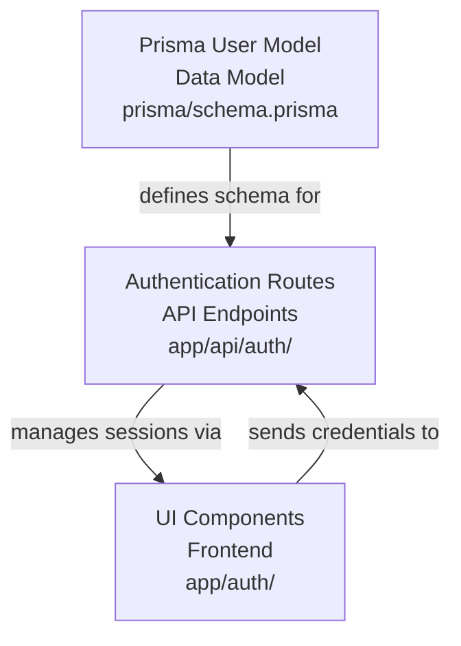
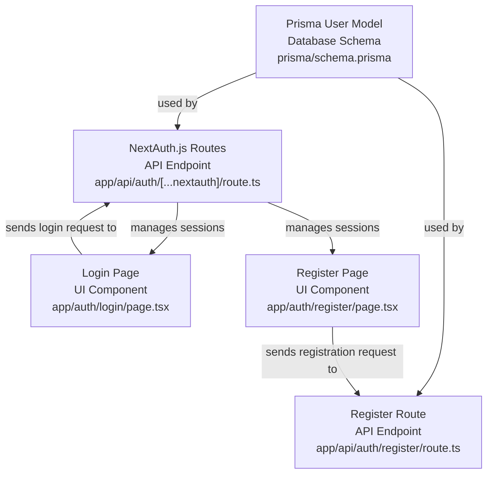
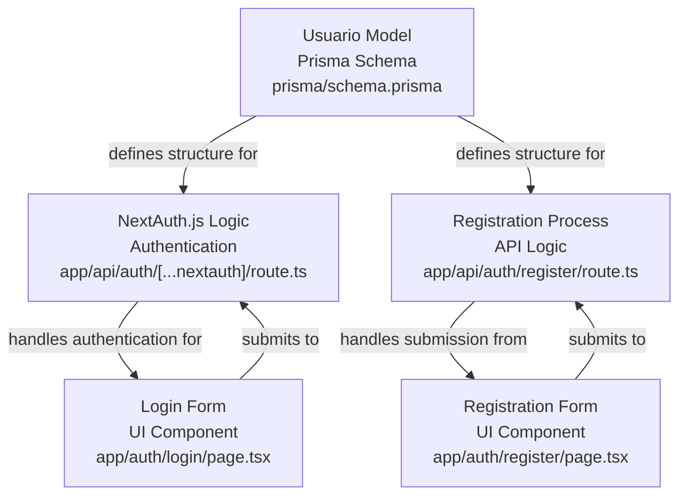

# Codebase Research Report

## Query
Investigate the "User" component in detail. Provide a comprehensive analysis of its architecture, responsibilities, and implementation details.

## Answer
# User Component Analysis

The "User" component in this application primarily revolves around authentication and user data management, with its core definition residing in the Prisma schema and its functionality exposed through Next.js API routes and authentication components. There isn't a single, monolithic "User" component, but rather a distributed set of functionalities that collectively manage user-related concerns.

## High-Level Architecture




User management is integrated into the application's authentication flow, leveraging NextAuth.js for session management and Prisma for database interactions. The main components involved are:

*   **Prisma User Model**: Defines the structure and relationships of user data in the database.
*   **Authentication Routes**: Handles user login, registration, and session management.
*   **UI Components**: Provides the user interface for authentication (login/register forms).

## Mid-Level Component Interaction




### **Prisma User Model**

The **User** model is defined in the Prisma schema, outlining the fields and relationships for user data. It serves as the single source of truth for user data persistence.

*   **Purpose**: To define the database schema for user entities, including authentication details and profile information.
*   **Internal Parts**: The [schema.prisma](prisma/schema.prisma) file contains the `User` model definition.
*   **External Relationships**: This model is used by the NextAuth.js adapter to interact with the database for user creation, retrieval, and updates during authentication flows.

The `Usuario` model in [schema.prisma](prisma/schema.prisma) defines the user structure with fields like `id`, `email`, `password`, `nombre`, and `confirmado`.

### **Authentication Routes**

The application uses Next.js API routes for handling authentication. These routes are responsible for processing login and registration requests, interacting with the database (via Prisma), and managing user sessions.

*   **Purpose**: To provide API endpoints for user authentication (login, register) and session management.
*   **Internal Parts**:
    *   [route.ts](app/api/auth/login/route.ts) handles user login.
    *   [route.ts](app/api/auth/register/route.ts) handles user registration.
*   **External Relationships**: These routes interact with the Prisma client to query and update user data in the database. They also set up and manage user sessions using NextAuth.js.

My apologies, it seems I made an assumption about the file structure. The authentication routes are located at [app/api/auth/[...nextauth]/route.ts](app/api/auth/[...nextauth]/route.ts) for NextAuth.js handling and [app/api/auth/register/route.ts](app/api/auth/register/route.ts) for user registration.

### **UI Components**

The user interface for authentication is handled by dedicated components that provide forms for login and registration.

*   **Purpose**: To provide interactive forms for users to log in or register.
*   **Internal Parts**:
    *   [page.tsx](app/auth/login/page.tsx) for the login page.
    *   [page.tsx](app/auth/register/page.tsx) for the registration page.
*   **External Relationships**: These components send user credentials to the authentication API routes for processing.

## Low-Level Implementation Details




### **User Model in Prisma**

The `Usuario` model in [schema.prisma](prisma/schema.prisma) defines the fields for a user:

```prisma
model Usuario {
    id Int @id @default(autoincrement())
    email String
    password String
    nombre String
    confirmado Boolean @default(false)
}
```

This model is then used by Prisma Client to interact with the database.

### **Authentication Logic**

The core authentication logic is handled by NextAuth.js, configured in [app/api/auth/[...nextauth]/route.ts](app/api/auth/[...nextauth]/route.ts). This file defines the authentication providers (e.g., credentials provider) and callbacks for session management.

The registration process, handled by [app/api/auth/register/route.ts](app/api/auth/register/route.ts), involves:

1.  Receiving user input (email, password, name).
2.  Hashing the password for security.
3.  Creating a new user record in the database using Prisma.

### **UI Forms**

The login form in [page.tsx](app/auth/login/page.tsx) and the registration form in [page.tsx](app/auth/register/page.tsx) are responsible for:

1.  Capturing user input.
2.  Performing client-side validation.
3.  Submitting the data to the respective API routes.

These forms likely use a state management solution (e.g., React hooks) to manage form data and display validation errors.

---
*Generated by [CodeViz.ai](https://codeviz.ai) on 5/7/2025, 8:17:08 p.m.*
