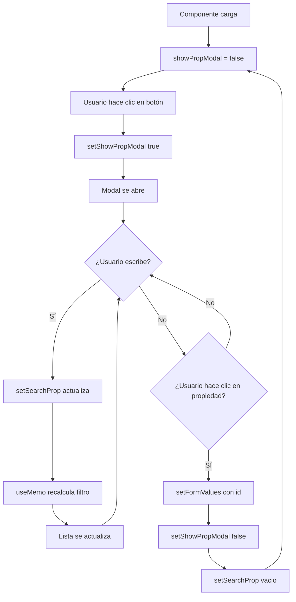

# 🎓 Guía Didáctica: Modal de Selección de Propiedad

**Componente**: `ContratoFormDynamic.tsx`  
**Fecha**: 20/11/2024  
**Objetivo**: Explicar paso a paso cómo funciona el modal de selección de propiedad con búsqueda y visualización en columnas.

---

## 📚 Tabla de Contenidos

1. [Introducción](#introducción)
2. [Conceptos Fundamentales](#conceptos-fundamentales)
3. [Estructura del Código](#estructura-del-código)
4. [Flujo de Funcionamiento](#flujo-de-funcionamiento)
5. [Ejemplos Prácticos](#ejemplos-prácticos)
6. [Mejores Prácticas](#mejores-prácticas)

---

## 🎯 Introducción

### ¿Qué es un Modal?

Un **modal** es una ventana emergente que se superpone al contenido principal de la página y requiere una acción del usuario antes de poder continuar. Es como una "caja de diálogo" que aparece encima de todo.

**Ventajas del Modal**:
- ✅ Mejor experiencia de usuario (UX)
- ✅ Búsqueda y filtrado en tiempo real
- ✅ Visualización organizada de datos
- ✅ No navega a otra página

### ¿Por qué usar Modal en lugar de un `<select>`?

| Característica | `<select>` tradicional | Modal con búsqueda |
|----------------|------------------------|-------------------|
| **Búsqueda** | ❌ No disponible | ✅ Búsqueda en tiempo real |
| **Información** | Solo un campo | ✅ Múltiples columnas |
| **UX** | Limitado | ✅ Interactivo y visual |
| **Cantidad datos** | Lento con muchos items | ✅ Eficiente con scroll |

---

## 🧩 Conceptos Fundamentales

### 1. **Estado (State)** en React

El estado es una "memoria" del componente que guarda información y cuando cambia, el componente se re-renderiza.

```typescript
const [showPropModal, setShowPropModal] = useState(false);
const [searchProp, setSearchProp] = useState("");
```

**Explicación**:
- `showPropModal`: Controla si el modal está abierto (true) o cerrado (false)
- `searchProp`: Guarda el texto que el usuario escribe en el buscador
- `useState(false)`: Valor inicial (modal cerrado al cargar)
- `setShowPropModal`: Función para cambiar el estado

**Analogía**: Es como un interruptor de luz:
- `showPropModal = false` → luz apagada (modal oculto)
- `showPropModal = true` → luz encendida (modal visible)

### 2. **useMemo** - Optimización de Rendimiento

`useMemo` es un hook que "memoriza" el resultado de un cálculo para no repetirlo innecesariamente.

```typescript
const filteredPropiedades = useMemo(() => {
    // Cálculo pesado aquí
}, [searchProp, propiedades]);
```

**¿Cuándo se recalcula?**
- Solo cuando `searchProp` o `propiedades` cambian
- NO se recalcula en cada render del componente

**Analogía**: Es como una calculadora con memoria:
- Si le preguntas "2+2" varias veces, la primera vez calcula (4) y luego recuerda el resultado
- Solo recalcula si cambias los números (ej: "3+3")

### 3. **Componente Modal Reutilizable**

El componente `<Modal>` es una "caja" genérica que puede contener cualquier contenido.

```typescript
<Modal isOpen={showPropModal} onClose={() => setShowPropModal(false)}>
    {/* Contenido personalizado aquí */}
</Modal>
```

**Props del Modal**:
- `isOpen`: Controla visibilidad (true/false)
- `onClose`: Función que se ejecuta al cerrar
- `children`: Contenido interno del modal

---

## 🏗️ Estructura del Código

### Paso 1: Declaración de Estados

```typescript
// Estado para controlar apertura/cierre del modal
const [showPropModal, setShowPropModal] = useState(false);

// Estado para guardar el texto de búsqueda
const [searchProp, setSearchProp] = useState("");
```

**¿Qué hace cada línea?**

| Línea | Función |
|-------|---------|
| `const [showPropModal, ...]` | Crea variable para saber si modal está abierto |
| `setShowPropModal` | Función para abrir/cerrar modal |
| `useState(false)` | Valor inicial: modal cerrado |
| `const [searchProp, ...]` | Crea variable para texto de búsqueda |
| `useState("")` | Valor inicial: texto vacío |

### Paso 2: Filtrado Inteligente con useMemo

```typescript
const filteredPropiedades = useMemo(() => {
    // Si no hay búsqueda, mostrar todas
    if (!searchProp) return propiedades;
    
    const searchLower = searchProp.toLowerCase();
    
    return propiedades.filter((p) => {
        // Construir dirección completa
        const direccion = [
            p.calle,
            p.numero?.toString(),
            p.piso ? `piso ${p.piso}` : '',
            p.departamento ? `depto ${p.departamento}` : ''
        ].filter(Boolean).join(' ').toLowerCase();

        // Buscar en descripción O en dirección
        return (
            p.descripcion.toLowerCase().includes(searchLower) ||
            direccion.includes(searchLower)
        );
    });
}, [searchProp, propiedades]);
```

**Desglose detallado**:

#### 2.1. Condición inicial
```typescript
if (!searchProp) return propiedades;
```
- Si el usuario NO escribió nada, mostrar TODAS las propiedades
- Ejemplo: Usuario abre modal → ve todas las opciones

#### 2.2. Convertir búsqueda a minúsculas
```typescript
const searchLower = searchProp.toLowerCase();
```
- Convierte "PALERMO" → "palermo"
- Permite búsqueda case-insensitive (no importan mayúsculas/minúsculas)

#### 2.3. Construcción de dirección
```typescript
const direccion = [
    p.calle,                              // "Thames"
    p.numero?.toString(),                 // "1234"
    p.piso ? `piso ${p.piso}` : '',      // "piso 2" o ""
    p.departamento ? `depto ${p.departamento}` : '' // "depto A" o ""
].filter(Boolean).join(' ').toLowerCase();
```

**Paso a paso**:

1. **Crear array con partes**:
   ```javascript
   ["Thames", "1234", "piso 2", "depto A"]
   ```

2. **`.filter(Boolean)`**: Eliminar valores vacíos
   ```javascript
   // Si no hay piso ni depto:
   ["Thames", "1234", "", ""] → ["Thames", "1234"]
   ```

3. **`.join(' ')`**: Unir con espacios
   ```javascript
   "Thames 1234 piso 2 depto A"
   ```

4. **`.toLowerCase()`**: Convertir a minúsculas
   ```javascript
   "thames 1234 piso 2 depto a"
   ```

#### 2.4. Filtrado final
```typescript
return (
    p.descripcion.toLowerCase().includes(searchLower) ||
    direccion.includes(searchLower)
);
```

**Tabla de verdad**:

| Búsqueda | Descripción | Dirección | ¿Muestra? |
|----------|-------------|-----------|-----------|
| "palermo" | "Casa **Palermo**" | "Thames 1234" | ✅ Sí (match descripción) |
| "thames" | "Casa Norte" | "**Thames** 1234" | ✅ Sí (match dirección) |
| "1234" | "Casa Sur" | "Thames **1234**" | ✅ Sí (match dirección) |
| "depto a" | "Oficina" | "Cabildo 5678 **Depto A**" | ✅ Sí (match dirección) |
| "belgrano" | "Casa Palermo" | "Thames 1234" | ❌ No (sin match) |

### Paso 3: Botón que Abre el Modal

```typescript
<button
    id="propiedadId"
    type="button"
    className="block w-full p-3 bg-slate-200 text-left rounded hover:bg-slate-300 transition-colors"
    onClick={() => setShowPropModal(true)}
>
    {formValues.propiedadId
        ? propiedades.find((p) => p.id === formValues.propiedadId)?.descripcion || 'Seleccionar propiedad'
        : 'Seleccionar propiedad'}
</button>
```

**¿Qué muestra el botón?**

```typescript
formValues.propiedadId ? 
    propiedades.find((p) => p.id === formValues.propiedadId)?.descripcion 
    : 'Seleccionar propiedad'
```

**Flujo de decisión**:

```
¿Hay propiedad seleccionada?
│
├─ SÍ (id = 5)
│  └─ Buscar propiedad con id=5
│     └─ Mostrar su descripción: "Casa Palermo"
│
└─ NO (id = 0 o null)
   └─ Mostrar texto por defecto: "Seleccionar propiedad"
```

**Ejemplo práctico**:
1. **Al cargar**: `formValues.propiedadId = 0` → Muestra "Seleccionar propiedad"
2. **Después de elegir**: `formValues.propiedadId = 5` → Muestra "Casa Palermo"

### Paso 4: El Modal Completo

```typescript
<Modal isOpen={showPropModal} onClose={() => setShowPropModal(false)}>
    {/* Contenido del modal */}
</Modal>
```

**Props explicadas**:

| Prop | Valor | Función |
|------|-------|---------|
| `isOpen` | `showPropModal` | Controla visibilidad |
| `onClose` | `() => setShowPropModal(false)` | Cierra al hacer clic afuera |

#### 4.1. Título del Modal
```typescript
<h3 className="text-lg font-bold mb-4 text-slate-800">
    Seleccionar Propiedad
</h3>
```

#### 4.2. Input de Búsqueda
```typescript
<div className="mb-4">
    <input
        type="text"
        placeholder="Buscar por descripción o dirección..."
        className="w-full p-2 border border-gray-300 rounded focus:outline-none focus:ring-2 focus:ring-red-500"
        value={searchProp}
        onChange={(e) => setSearchProp(e.target.value)}
    />
</div>
```

**Evento `onChange` explicado**:

```typescript
onChange={(e) => setSearchProp(e.target.value)}
```

**Flujo**:
1. Usuario escribe "p" → `e.target.value = "p"`
2. Ejecuta `setSearchProp("p")`
3. `searchProp` cambia de "" a "p"
4. React re-renderiza componente
5. `useMemo` detecta cambio en `searchProp`
6. Recalcula `filteredPropiedades`
7. Lista se actualiza automáticamente

**Diagrama de flujo**:
```
Usuario escribe → onChange → setSearchProp → Estado cambia
                                                    ↓
              Lista actualizada ← Re-render ← useMemo recalcula
```

#### 4.3. Contenedor con Scroll
```typescript
<div className="max-h-96 overflow-y-auto">
```

**Clases CSS explicadas**:
- `max-h-96`: Altura máxima de 24rem (384px)
- `overflow-y-auto`: Si contenido excede altura, mostrar scroll vertical

**Comportamiento**:
```
Contenido < 384px → Sin scroll, altura natural
Contenido > 384px → Scroll vertical, altura fija 384px
```

#### 4.4. Mensaje de "No hay resultados"
```typescript
{filteredPropiedades.length === 0 && (
    <div className="text-gray-500 text-center py-4">
        No se encontraron propiedades.
    </div>
)}
```

**Lógica**:
- Solo se renderiza si `filteredPropiedades.length === 0`
- Operador `&&`: Si primera condición es `true`, renderiza lo segundo

#### 4.5. Encabezados de Columnas
```typescript
{filteredPropiedades.length > 0 && (
    <div className="grid grid-cols-2 gap-4 p-3 bg-slate-700 text-white font-bold sticky top-0 z-10 rounded">
        <div>Descripción</div>
        <div>Dirección</div>
    </div>
)}
```

**Clases importantes**:
- `grid grid-cols-2`: Dos columnas de igual tamaño
- `sticky top-0`: Se mantiene fijo al hacer scroll
- `z-10`: Aparece encima del contenido (z-index)

**Comportamiento visual**:
```
┌─────────────────────────────────┐
│ Descripción  │  Dirección       │ ← sticky (siempre visible)
├──────────────┼──────────────────┤
│ Casa 1       │  Thames 1234     │
│ Casa 2       │  Cabildo 5678    │ ← scroll aquí
│ Casa 3       │  Florida 999     │
└──────────────┴──────────────────┘
```

#### 4.6. Lista de Propiedades (el corazón del modal)

```typescript
{filteredPropiedades.map((propiedad) => {
    // 1. Construir dirección completa
    const direccion = [
        propiedad.calle,
        propiedad.numero,
        propiedad.piso ? `Piso ${propiedad.piso}` : null,
        propiedad.departamento ? `Depto ${propiedad.departamento}` : null
    ].filter(Boolean).join(' ');

    return (
        // 2. Renderizar fila
        <div
            key={propiedad.id}
            className={`grid grid-cols-2 gap-4 p-3 cursor-pointer hover:bg-slate-100 rounded border-b last:border-b-0 transition-colors ${
                formValues.propiedadId === propiedad.id ? 'bg-slate-200 font-bold' : ''
            }`}
            onClick={() => {
                setFormValues({ propiedadId: propiedad.id });
                setShowPropModal(false);
                setSearchProp("");
            }}
        >
            <div className="font-medium">{propiedad.descripcion}</div>
            <div className="text-gray-700">{direccion}</div>
        </div>
    );
})}
```

**Desglose paso a paso**:

##### 4.6.1. Construcción de dirección (dentro del map)

```typescript
const direccion = [
    propiedad.calle,        // "Thames"
    propiedad.numero,       // 1234
    propiedad.piso ? `Piso ${propiedad.piso}` : null,
    propiedad.departamento ? `Depto ${propiedad.departamento}` : null
].filter(Boolean).join(' ');
```

**Ejemplo con datos**:

**Caso 1: Propiedad completa**
```javascript
{
  calle: "Thames",
  numero: 1234,
  piso: "2",
  departamento: "A"
}

// Array:
["Thames", 1234, "Piso 2", "Depto A"]

// Después de filter(Boolean):
["Thames", 1234, "Piso 2", "Depto A"]

// Después de join(' '):
"Thames 1234 Piso 2 Depto A"
```

**Caso 2: Sin piso ni departamento**
```javascript
{
  calle: "Cabildo",
  numero: 5678,
  piso: null,
  departamento: null
}

// Array:
["Cabildo", 5678, null, null]

// Después de filter(Boolean):
["Cabildo", 5678]

// Después de join(' '):
"Cabildo 5678"
```

##### 4.6.2. Clases CSS dinámicas

```typescript
className={`grid grid-cols-2 gap-4 p-3 cursor-pointer hover:bg-slate-100 rounded border-b last:border-b-0 transition-colors ${
    formValues.propiedadId === propiedad.id ? 'bg-slate-200 font-bold' : ''
}`}
```

**Clases estáticas** (siempre aplicadas):
- `grid grid-cols-2`: Dos columnas
- `gap-4`: Espacio entre columnas
- `p-3`: Padding interno
- `cursor-pointer`: Cursor en forma de mano
- `hover:bg-slate-100`: Fondo gris al pasar mouse
- `rounded`: Bordes redondeados
- `border-b`: Borde inferior
- `last:border-b-0`: Última fila sin borde
- `transition-colors`: Animación suave de colores

**Clases dinámicas** (condicionales):
```typescript
formValues.propiedadId === propiedad.id ? 'bg-slate-200 font-bold' : ''
```

**Tabla de comportamiento**:

| Condición | Propiedad seleccionada | Clases aplicadas |
|-----------|------------------------|------------------|
| `id = 5` y `formValues.propiedadId = 5` | ✅ Sí | `bg-slate-200 font-bold` (gris + negrita) |
| `id = 3` y `formValues.propiedadId = 5` | ❌ No | `''` (ninguna extra) |

##### 4.6.3. Evento onClick (la acción)

```typescript
onClick={() => {
    setFormValues({ propiedadId: propiedad.id });
    setShowPropModal(false);
    setSearchProp("");
}}
```

**Secuencia de acciones**:

```
1. Usuario hace clic en propiedad con id=7
   ↓
2. setFormValues({ propiedadId: 7 })
   → Guarda id=7 en el formulario
   ↓
3. setShowPropModal(false)
   → Cierra el modal
   ↓
4. setSearchProp("")
   → Limpia el texto de búsqueda
   → Próxima vez que abra el modal, verá todas las opciones
```

**Ejemplo visual del flujo completo**:

```
┌─────────────────────────────────────────┐
│ Estado inicial                          │
│ formValues.propiedadId = 0              │
│ showPropModal = false                   │
│ searchProp = ""                         │
└─────────────────────────────────────────┘
                  ↓
    Usuario hace clic en botón
                  ↓
┌─────────────────────────────────────────┐
│ setShowPropModal(true)                  │
│ Modal se abre                           │
└─────────────────────────────────────────┘
                  ↓
    Usuario escribe "thames"
                  ↓
┌─────────────────────────────────────────┐
│ setSearchProp("thames")                 │
│ useMemo recalcula filteredPropiedades   │
│ Lista muestra solo coincidencias        │
└─────────────────────────────────────────┘
                  ↓
    Usuario hace clic en "Thames 1234"
                  ↓
┌─────────────────────────────────────────┐
│ setFormValues({ propiedadId: 7 })       │
│ setShowPropModal(false)                 │
│ setSearchProp("")                       │
│                                         │
│ Resultado:                              │
│ - Modal cerrado                         │
│ - Propiedad seleccionada                │
│ - Búsqueda reseteada                    │
│ - Botón muestra "Thames 1234..."        │
└─────────────────────────────────────────┘
```

---

## 🔄 Flujo de Funcionamiento

### Diagrama de Estados



### Ciclo de Vida Completo

**1. Montaje del componente**
```typescript
// Se crean los estados
const [showPropModal, setShowPropModal] = useState(false);
const [searchProp, setSearchProp] = useState("");

// Se calcula lista filtrada (inicialmente todas)
const filteredPropiedades = useMemo(() => propiedades, []);
```

**2. Usuario abre modal**
```typescript
onClick={() => setShowPropModal(true)}
// showPropModal: false → true
// React re-renderiza
// Modal se hace visible
```

**3. Usuario busca "palermo"**

| Keypress | searchProp | filteredPropiedades | Renders |
|----------|------------|---------------------|---------|
| "p" | "p" | 15 propiedades | 1 |
| "pa" | "pa" | 8 propiedades | 2 |
| "pal" | "pal" | 3 propiedades | 3 |
| "pale" | "pale" | 2 propiedades | 4 |
| "paler" | "paler" | 1 propiedad | 5 |
| "palerm" | "palerm" | 1 propiedad | 6 |
| "palermo" | "palermo" | 1 propiedad | 7 |

**4. Usuario selecciona propiedad**
```typescript
onClick={() => {
    setFormValues({ propiedadId: 7 });      // Guardar selección
    setShowPropModal(false);                // Cerrar modal
    setSearchProp("");                      // Limpiar búsqueda
}}
```

**Estado final**:
```javascript
{
  formValues: { propiedadId: 7, ... },
  showPropModal: false,
  searchProp: ""
}
```

---

## 💡 Ejemplos Prácticos

### Ejemplo 1: Búsqueda por Descripción

**Usuario escribe**: "casa"

**Base de datos**:
```javascript
[
  { id: 1, descripcion: "Casa Palermo", calle: "Thames", numero: 1234 },
  { id: 2, descripcion: "Depto Belgrano", calle: "Cabildo", numero: 5678 },
  { id: 3, descripcion: "Casa Recoleta", calle: "Junín", numero: 999 }
]
```

**Proceso de filtrado**:

1. `searchProp = "casa"` → `searchLower = "casa"`

2. Para cada propiedad:
   ```javascript
   // Propiedad 1
   "Casa Palermo".toLowerCase().includes("casa") → "casa palermo".includes("casa") → true ✅
   
   // Propiedad 2
   "Depto Belgrano".toLowerCase().includes("casa") → "depto belgrano".includes("casa") → false ❌
   
   // Propiedad 3
   "Casa Recoleta".toLowerCase().includes("casa") → "casa recoleta".includes("casa") → true ✅
   ```

3. **Resultado**: Muestra propiedades 1 y 3

### Ejemplo 2: Búsqueda por Dirección

**Usuario escribe**: "thames"

**Proceso de filtrado**:

```javascript
// Propiedad 1
descripcion: "Casa Palermo"
direccion: "thames 1234" ← MATCH ✅
Resultado: Mostrar

// Propiedad 2
descripcion: "Depto Belgrano"
direccion: "cabildo 5678"
Resultado: No mostrar ❌

// Propiedad 3
descripcion: "Casa Recoleta"
direccion: "junín 999"
Resultado: No mostrar ❌
```

**Resultado**: Solo muestra propiedad 1

### Ejemplo 3: Búsqueda por Número

**Usuario escribe**: "1234"

```javascript
// Propiedad 1
direccion: "thames 1234 piso 2 depto a"
"thames 1234 piso 2 depto a".includes("1234") → true ✅
```

**Resultado**: Muestra todas las propiedades con "1234" en la dirección

### Ejemplo 4: Sin Resultados

**Usuario escribe**: "xyz123"

```javascript
// Todas las propiedades
descripcion.includes("xyz123") → false
direccion.includes("xyz123") → false

filteredPropiedades.length === 0 → true
```

**Renderiza**:
```html
<div className="text-gray-500 text-center py-4">
    No se encontraron propiedades.
</div>
```

---

## 🎨 Mejores Prácticas

### 1. **Usar `useMemo` para Operaciones Costosas**

❌ **Mal** (sin useMemo):
```typescript
// Se recalcula en CADA render, incluso si propiedades no cambian
const filteredPropiedades = propiedades.filter((p) => 
    p.descripcion.toLowerCase().includes(searchProp.toLowerCase())
);
```

✅ **Bien** (con useMemo):
```typescript
// Solo se recalcula cuando searchProp o propiedades cambian
const filteredPropiedades = useMemo(() => {
    return propiedades.filter((p) => 
        p.descripcion.toLowerCase().includes(searchProp.toLowerCase())
    );
}, [searchProp, propiedades]);
```

**Rendimiento comparado**:

| Escenario | Sin useMemo | Con useMemo | Mejora |
|-----------|-------------|-------------|--------|
| 100 propiedades | 100 filtros en 10 renders | 1 filtro | 99% menos cálculos |
| 1000 propiedades | 1000 filtros en 10 renders | 1 filtro | 99.9% menos cálculos |

### 2. **Limpiar Estado al Cerrar Modal**

✅ **Correcto**:
```typescript
onClick={() => {
    setFormValues({ propiedadId: propiedad.id });
    setShowPropModal(false);
    setSearchProp("");  // ← Limpiar búsqueda
}}
```

**¿Por qué?**
- Usuario abre modal de nuevo → Ve todas las opciones
- No queda búsqueda anterior confusa

### 3. **Búsqueda Case-Insensitive**

```typescript
const searchLower = searchProp.toLowerCase();
p.descripcion.toLowerCase().includes(searchLower)
```

**Beneficio**:
- "PALERMO", "Palermo", "palermo" → Todos encuentran "Casa Palermo"

### 4. **Usar `?.` (Optional Chaining)**

```typescript
propiedad.numero?.toString()
```

**Protección contra errores**:
```javascript
// Si numero es null/undefined
null?.toString() → undefined (sin error ✅)

// Sin optional chaining
null.toString() → ERROR ❌
```

### 5. **Sticky Headers para Mejor UX**

```typescript
<div className="sticky top-0 z-10 bg-slate-700">
    {/* Headers siempre visibles */}
</div>
```

**Beneficio**:
```
┌─────────────────────┐
│ Desc    │  Dirección│ ← Siempre visible
├─────────┼───────────┤
│ Item 1  │  Dir 1    │
│ Item 2  │  Dir 2    │ ← Scroll aquí
│ Item 3  │  Dir 3    │
│ ...     │  ...      │
└─────────┴───────────┘
```

### 6. **Feedback Visual de Selección**

```typescript
className={formValues.propiedadId === propiedad.id 
    ? 'bg-slate-200 font-bold'  // ← Seleccionado
    : ''                         // ← Normal
}
```

**UX**:
- Usuario ve claramente qué tiene seleccionado
- Evita confusión

---

## 🔍 Debugging y Troubleshooting

### Problema 1: Modal no se abre

**Síntoma**: Click en botón no hace nada

**Verificar**:
```typescript
console.log('showPropModal:', showPropModal);
```

**Solución**:
```typescript
// Asegurar que onClick actualiza estado
onClick={() => {
    console.log('Abriendo modal...');
    setShowPropModal(true);
}}
```

### Problema 2: Búsqueda no filtra

**Síntoma**: Escribir no actualiza lista

**Verificar**:
```typescript
console.log('searchProp:', searchProp);
console.log('filteredPropiedades:', filteredPropiedades);
```

**Solución**:
```typescript
// Asegurar onChange actualiza estado
onChange={(e) => {
    console.log('Nuevo valor:', e.target.value);
    setSearchProp(e.target.value);
}}
```

### Problema 3: Modal no cierra al seleccionar

**Síntoma**: Click en propiedad no cierra modal

**Verificar**:
```typescript
onClick={() => {
    console.log('Seleccionando:', propiedad.id);
    setFormValues({ propiedadId: propiedad.id });
    console.log('Cerrando modal...');
    setShowPropModal(false);
}}
```

---

## 📊 Comparación: Antes vs Después

### Antes (Select Simple)

```typescript
<select name="propiedadId" value={formValues.propiedadId}>
    <option value="">Seleccionar</option>
    {propiedades.map(p => (
        <option key={p.id} value={p.id}>
            {p.descripcion}
        </option>
    ))}
</select>
```

**Limitaciones**:
- ❌ Solo muestra descripción
- ❌ Sin búsqueda
- ❌ Difícil navegar con muchos items
- ❌ UX pobre

### Después (Modal Interactivo)

**Ventajas**:
- ✅ Dos columnas (descripción + dirección)
- ✅ Búsqueda en tiempo real
- ✅ Scroll eficiente
- ✅ Headers sticky
- ✅ Feedback visual
- ✅ UX profesional

---

## 🎯 Conclusión

El modal de selección de propiedad implementa:

1. **Estado local** con `useState` para control de visibilidad y búsqueda
2. **Optimización** con `useMemo` para evitar cálculos innecesarios
3. **Búsqueda inteligente** en múltiples campos
4. **UX profesional** con feedback visual y navegación fluida
5. **Código limpio** y mantenible

**Beneficios clave**:
- 🚀 Rendimiento optimizado
- 👤 Mejor experiencia de usuario
- 🔍 Búsqueda poderosa
- 📱 Responsive y accesible
- 🎨 Diseño profesional

---

**Autor**: GitHub Copilot  
**Fecha**: 20/11/2024  
**Versión**: 1.0
